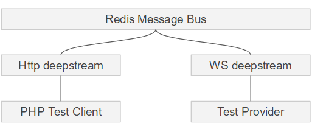

# deepstream.io-client-php
PHP Client using the dsh HTTP API

# Installing & running tests
Running the tests is a bit trickier as it requires a two-node deepstream cluster, consisting of a Websocket deepstream with a test-provider that answers RPCs and listens for events and a HTTP deepstream that the actual tests are run against:



- Install PHP - you can get it from e.g. [http://windows.php.net/download/](http://windows.php.net/download/) for windows
- Add the folder with the executables (e.g. php.exe, php-cli.exe) to your path
- Download PHP Unit from [https://phpunit.de/](https://phpunit.de/)
- Move the `phpunit-6.2.1.phar` file to your `deepstream.io-client-php` folder
- Make it executable via
```bash
chmod +x phpunit.phar
```
- Download a local version of Redis and run it on its default port
- Download the latest deepstream version and unzip it
- run `git clone git@github.com:deepstreamIO/dsx-connection-http.git` in its lib directory
- install the plugin via `yarn install`
- copy the configs in `ds-conf` into your deepstream's conf directory
- install the redis msg connector using `./deepstream.exe install msg redis`
- start two deepstream instances with
 ```bash
 ./deepstream.exe start -c conf/config-http.yml
 ```
and
 ```bash
 ./deepstream.exe start -c conf/config-ws.yml
 ```
- install the test provider in the `deepstream.io-client-php`
```bash
cd test-provider
yarn install
```
- run the test provider
```bash
node test-provider.js
```
- run the tests using
```
php phpunit-6.2.1.phar --bootstrap src\DeepstreamClient.php test\client-test.php
```

If it all works it looks like this


## API

### `new DeepstreamClient( $url, $authData )`
Creates the deepstream client
```php
$client = new DeepstreamClient( 'https://api.deepstreamhub.com/api/v1', array(
    'token' => 'xxxx-xxxx-xxxx-xxxx'
))
```

### `setRecord( $recordName, [$path], $data )`
Writes full or partial data to a record
```php
    # Writing full data
    $client->setRecord( 'user/johndoe', array(
        'firstname' => 'John',
        'lastname' => 'Doe',
        'age' => 32,
        'pets' => array( 'hamster', 'cat' )
    ));

    # Writing partial data
    $client->setRecord( 'user/johndoe', 'age', '33' );
```

### `$client->getRecord( $recordName )`
Reads the data for a given record
```php
    $firstname = $client->getRecord( 'user/johndoe' )->firstname;
```

### `$client->deleteRecord( $recordName )`
Deletes a record
```php
    $client->deleteRecord( 'user/johndoe' );
```

### `$client->getRecordVersion( $recordName )`
Retrieves the current version of a record
```php
    $version = $client->getRecordVersion( 'user/johndoe' );
```

### `$client->makeRpc( $rpcName, [$data] )`
Executes a Remote Procedure Call
```php
    #with data
    $twentyfour = $client->makeRpc( 'multiply-by-two', 12 );

    #without data
    $client->makeRpc( 'logout' );
```

### `$client->emitEvent( $eventName, [$data] )`
Emits an event
```php
    #with data
    $client->emitEvent( 'new-message', 'hey, what\'s up?' );

    #without data
    $client->emitEvent( 'ping' );
```

### `$client->startBatch()`
Starts a set of batch operations that will be executed as a single request

### `$client->executeBatch()`
Executes an existing set of batch operations
```php
    $client->startBatch()
    $client->emitEvent( 'new-message', 'hey, what\'s up?' );
    $client->getRecord( 'user/johndoe' );
    $client->setRecord( 'user/mike', 'age', 12 );
    $client->executeBatch();
```
